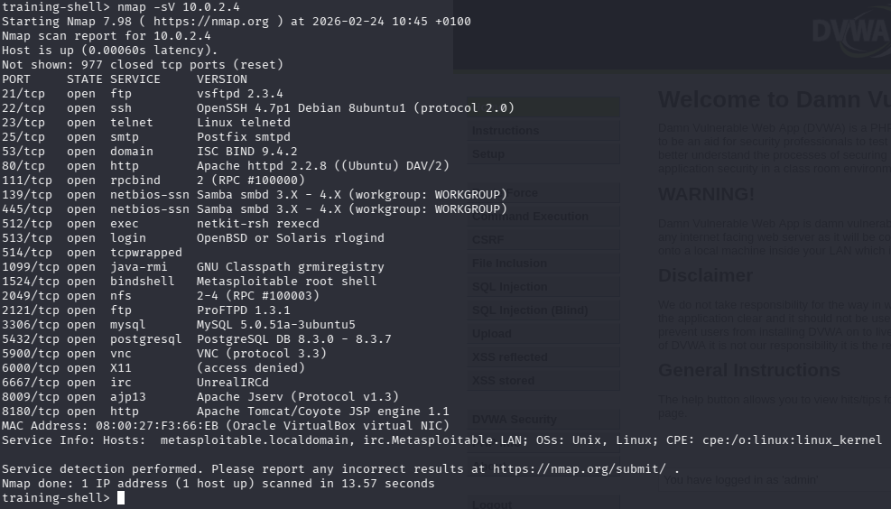
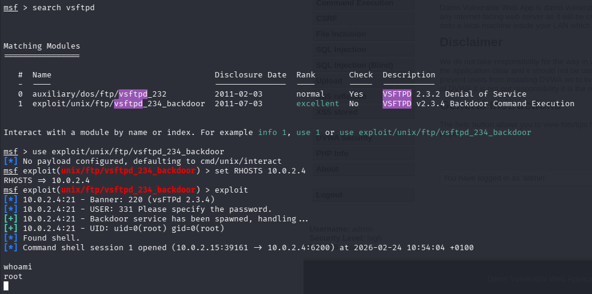
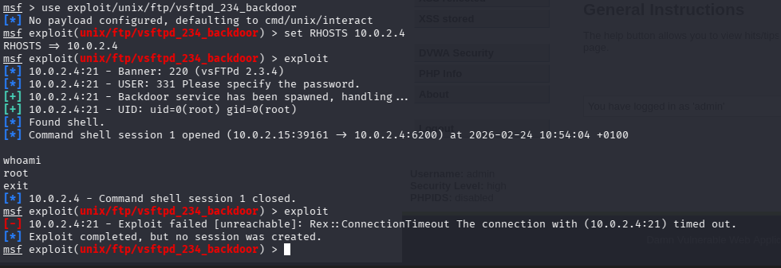
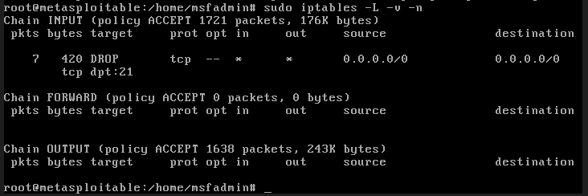

# Incident Response & Security Simulation

## 🎯 Objective
This repository documents a full-cycle security simulation encompassing both offensive (Red Team) and defensive (Blue Team) operations. The objective was to deploy a vulnerable enterprise server, execute a simulated external cyberattack, mitigate the active threat using host-based firewall configurations, and monitor the resulting network telemetry.

## 🛠️ Tools & Environment
* **Environment:** Air-gapped VirtualBox Host-Only Network (10.0.2.x)
* **Attacker Machine:** Kali Linux
* **Target Machine:** Metasploitable (Hosting DVWA and vulnerable services)
* **Techniques:** Service Enumeration, Exploitation, Firewall Configuration, Log Analysis
* **Tools:** Nmap, Metasploit Framework, iptables

---

## 🔴 Phase 1: Attack Simulation (Red Team)

### Reconnaissance & Vulnerability Identification
The engagement began with active reconnaissance to map the attack surface of the target server. A service version enumeration scan was executed using Nmap. 
The scan revealed multiple open ports. Critically, Port 21 was identified as running `vsftpd 2.3.4`, a version historically known to contain a malicious backdoor.

### Exploitation & Privilege Escalation
Upon identifying the vulnerable FTP service, the Metasploit Framework was utilized to weaponize the finding. 
The module `exploit/unix/ftp/vsftpd_234_backdoor` was executed, which triggered the backdoor mechanism and forced the target server to open a hidden command shell. Executing the `whoami` command verified that the session was running with full `root` administrator privileges.

---

## 🔵 Phase 2: Defense & Mitigation (Blue Team)

### Threat Mitigation via Firewall Configuration
To expel the attacker and secure the compromised service, immediate incident response actions were taken on the victim server. A host-based firewall rule was deployed using `iptables` to sever the attacker's access point and silently drop incoming TCP traffic to Port 21.

To confirm the effectiveness of the firewall rule, a secondary attack was launched from the Kali Linux machine. Because the `DROP` rule was active, the Metasploit framework failed to establish a connection.

### Security Monitoring & Telemetry Analysis
To verify the monitoring capabilities, the raw host-level telemetry was analyzed. The firewall logs were queried, and the output explicitly showed the new `DROP` rule actively capturing traffic. The telemetry recorded several dropped packets, providing undeniable forensic evidence that the firewall was actively intercepting and destroying malicious traffic originating from the attacker.

